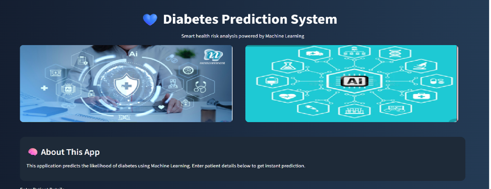
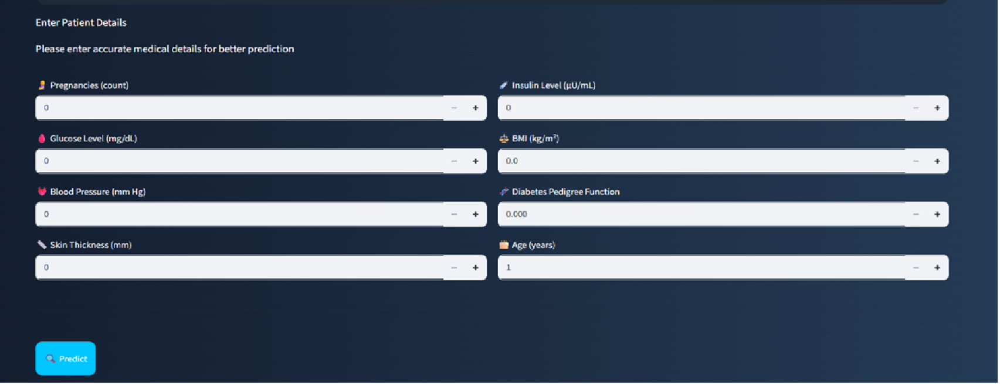

# 🩺 Diabetes Prediction Web App

## 📌 Overview

This project is a Machine Learning-based web application that predicts whether a person is likely to have diabetes based on medical input parameters. The application is built using **Python, Scikit-learn, and Streamlit**, providing an interactive and user-friendly interface.

---

## 🚀 Features

* 🔍 Predict diabetes risk instantly
* 📊 Uses trained Machine Learning model
* 💻 Interactive web interface with Streamlit
* 🎨 Clean and modern UI design
* ⚡ Real-time predictions based on user input

---

## 🛠️ Tech Stack

* **Programming Language:** Python
* **Libraries:** NumPy, Pandas, Scikit-learn
* **Framework:** Streamlit
* **Model:** Support Vector Machine (SVM)

---

## 📂 Project Structure

```
diabetes_app/
│── app.py
│── model.pkl
│── requirements.txt
│── README.md
│── image.png
│── image1.png
```

---

## ⚙️ Installation & Setup

1. Clone the repository:

```
git clone https://github.com/sangeetadhankhar10/diabetes-prediction-web-app.git
cd diabetes-prediction-web-app
```

2. Install dependencies:

```
pip install -r requirements.txt
```

3. Run the application:

```
streamlit run app.py
```

---

## 📊 How It Works

* User enters medical details (e.g., glucose, BMI, age, etc.)
* The trained ML model processes the input
* The app predicts whether the person is:

  * ⚠️ High Risk of Diabetes
  * ✅ Low Risk of Diabetes

---

## 🌐 Live Demo

👉 *(Add your deployed link here after deployment)*

---

## 📸 Screenshot




---

## 💡 Future Improvements

* Add more advanced models (Deep Learning)
* Improve UI with animations
* Deploy with database integration
* Add user authentication

---

## 👩‍💻 Author

**Sangeeta Dhankhar**
AI/ML Enthusiast 🚀

---

## ⭐ Acknowledgements

This project is part of my learning journey in Machine Learning and Web App development.

---
